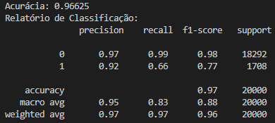
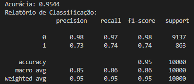
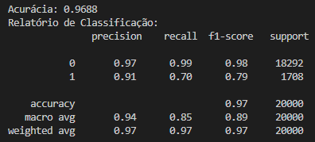
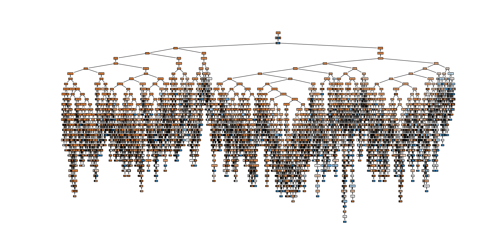
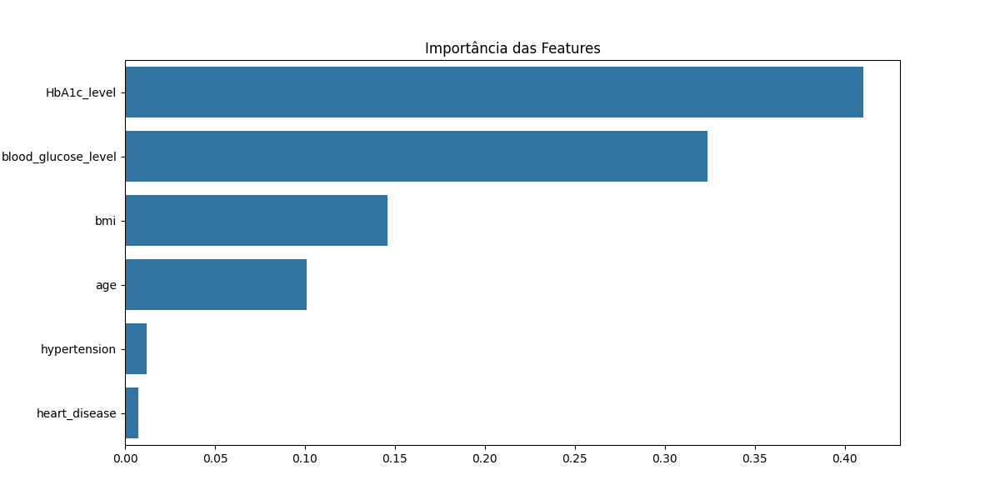

# 🩺 Diabetes Data Analysis Dashboard

This project presents a comprehensive Exploratory Data Analysis (EDA) on a diabetes dataset, including various visualizations, outlier detection, and machine learning techniques. The dashboard is built using Streamlit and Plotly to create interactive and dynamic visualizations.

## 🔍 Exploratory Data Analysis (EDA)

- **Age Distribution**: Visualize the distribution of patient ages.
- **BMI Distribution**: Examine the distribution of Body Mass Index (BMI) among patients.
- **HbA1c and Glucose Levels**: Visualize the distribution of HbA1c and blood glucose levels.

## 🔗 Correlation Analysis

- **Correlation Matrix**: Use the correlation matrix to explore how different variables are related.
- **Heatmap**: Create a heatmap of the correlation matrix for easier visualization of variable relationships.

## ⚖️ Group Comparison Analysis

- **Gender Comparison**: Compare the distributions of different metrics (BMI, HbA1c levels, glucose) between male and female patients.
- **Age Comparison**: Analyze how different age groups are associated with the presence of diabetes.

## 🚨 Outlier Analysis

- **Outlier Detection**: Identify and visualize outliers in numerical variables such as BMI, HbA1c levels, and blood glucose levels.

## 📊 Distribution Visualizations

- **Histograms**: Create histograms to visualize the distribution of each numerical variable.
- **[Boxplots](https://fernandafperes.com.br/blog/interpretacao-boxplot/)**: Use boxplots to summarize variable distributions and detect outliers.

## 🧬 Categorical Data Analysis

- **Smoking History Count**: Visualize the count of patients in each smoking history category.
- **Bar Charts**: Use bar charts to show the distribution of hypertension and heart disease among patients.

## 🤖 Machine Learning Analysis

- **Feature Importance**: Use machine learning techniques to evaluate the importance of different variables in predicting diabetes.
- **Clustering**: Apply clustering algorithms like K-means to identify hidden patterns in the data.

## 📈 Variable Relationship Analysis

- **Scatter Plots**: Visualize the relationship between pairs of variables, such as age and BMI, or glucose levels and HbA1c.
- **Pairplots**: Use Seaborn's pairplots to visualize relationships between multiple variables simultaneously.

## 🎯 Subgroup Analysis

- **Hypertension and Diabetes**: Specifically analyze patients who have both hypertension and diabetes.
- **Smoking History Subgroups**: Compare metrics among patients with different smoking histories.

## 🤖Machine Learning Algorithms

### 📊 Metrics Results

| KNN | Decision Tree | Random Forest |
|-----|-------------------|---------------|
|  |  |  |

### 📈 Plots

| Decision Tree | Random Forest |
|-----|-------------------|
|  |  |


## 🚀 How to Run

To set up and run the dashboard, follow these steps:

1. **Install the required packages**:
   ```bash
   pip install -r requirements.txt
   ```

2. **Launch the Streamlit app**:
   ```bash
   streamlit run main.py
   ```

   Once the app is running, you can view it in your browser:

   - **Local URL**: [http://localhost:8501](http://localhost:8501)
   - **Network URL**: (e.g., http://192.168.3.180:8501)